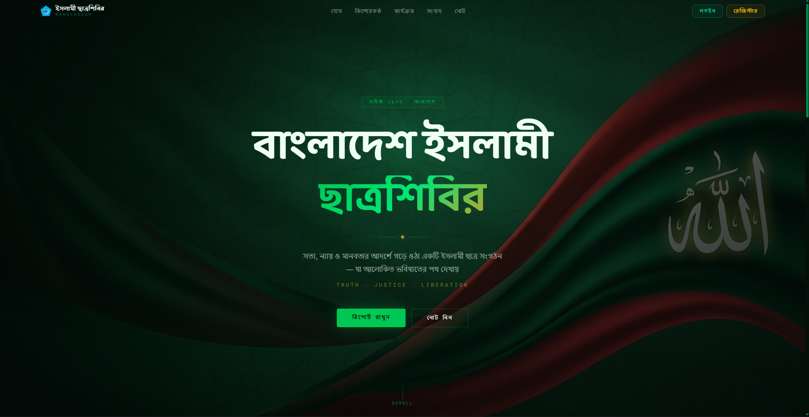

# Shibir — Digital Management Platform

> A modern full-stack organizational management platform built for Bangladesh Islami Chhatra Shibir, featuring role-based dashboards, digital reporting, learning management, assessments, real-time support, and secure authentication.

[](https://shibir-client.vercel.app/)



---

## Table of Contents

- [About the Project](#about-the-project)
- [Project Overview](#project-overview)
- [Highlights](#highlights)
- [Key Features](#key-features)
- [User Roles](#user-roles)
- [Tech Stack](#tech-stack)
- [Getting Started](#getting-started)
- [Project Structure](#project-structure)
- [Contact](#contact)

---

## About the Project

**Shibir** is a modern full-stack organizational management platform developed to digitize the operational, educational, and reporting workflows of Bangladesh Islami Chhatra Shibir.

The platform centralizes member management, structured reporting, educational resources, examinations, personal note-taking, and real-time support into a secure role-based system. It enables administrators to efficiently manage users and organizational activities while providing members with a streamlined experience for their daily responsibilities.

Built with a scalable architecture and modern technologies, the application emphasizes security, performance, and maintainability through Better Auth, PostgreSQL, Prisma ORM, Socket.IO, and Next.js.

---

## Project Overview

| Area | Description |
|------|-------------|
| **Objective** | Digitize organizational management, reporting, learning, and communication workflows. |
| **Target Users** | Supporters, Workers, Associates, Members, and Administrators. |
| **Authentication** | Better Auth with Email OTP Verification and Google OAuth. |
| **Authorization** | Role-Based Access Control (RBAC). |
| **Architecture** | Full-stack application powered by REST APIs and PostgreSQL. |
| **Deployment** | Frontend deployed on Vercel. |

---

## Highlights

- 🔐 Secure authentication with Better Auth
- ✉️ Email OTP verification and Google OAuth
- 👥 Role-Based Access Control (RBAC)
- 📊 Monthly reporting and activity management
- 📚 Learning resource & syllabus management
- 📝 Rich-text personal notes with TipTap
- 🧠 MCQ and Viva examination workflow
- 💬 Real-time support messaging with Socket.IO
- ⚙️ Dashboard analytics and user management
- 📱 Fully responsive modern user interface

---

## Key Features

### 🔐 Authentication & Security

- Secure authentication powered by Better Auth.
- Email/password and Google OAuth sign-in.
- Email OTP verification.
- Password recovery and reset.
- Protected routes with role-based authorization.

---

### 👥 Role-Based Dashboard

Separate dashboard experiences based on user responsibilities.

- Personalized dashboard.
- Dynamic sidebar navigation.
- Profile management.
- Permission-based feature access.

---

### 📊 Digital Reporting System

A centralized workflow for organizational reporting.

- Monthly report submission.
- Activity tracking.
- Progress monitoring.
- Administrative review and feedback.

---

### 📚 Learning & Assessment

Designed to support continuous member development.

- Role-based syllabus management.
- PDF learning resources.
- MCQ examination system.
- Written & Viva assessment workflow.
- Candidate evaluation and result publishing.

---

### 📝 Notes & Collaboration

Built-in productivity and communication tools.

- Rich-text personal notes.
- Knowledge organization.
- Real-time support conversations.
- Socket.IO powered messaging.

---

### ⚙️ Administration

Comprehensive tools for organizational management.

- User management.
- Role management.
- Dashboard analytics.
- Support conversation management.
- Examination administration.
- Centralized system monitoring.

---

### 🎨 Modern User Experience

- Responsive design.
- Bengali-first interface.
- Clean dashboard UI.
- Reusable components.
- Optimized performance.

---

## User Roles

| Role | Responsibilities |
|------|------------------|
| **Supporter** | Monthly reports, syllabus, notes, examinations, and support. |
| **Worker** | Reports, learning resources, notes, examinations, and support. |
| **Associate** | Reports, learning resources, notes, examinations, and support. |
| **Member** | Reports, syllabus, notes, and support. |
| **Admin** | User management, dashboard analytics, support management, and examination administration. |

---

## Tech Stack

### Frontend

- Next.js
- React
- TypeScript
- Tailwind CSS
- shadcn/ui
- Radix UI

### Backend

- Node.js
- Express.js
- Prisma ORM
- PostgreSQL
- Better Auth
- Socket.IO

### Libraries

- TanStack Query
- Axios
- Zod
- React Hook Form
- TipTap
- React PDF
- Framer Motion
- Recharts

### Deployment

- Vercel

---

## Getting Started

### Prerequisites

- Node.js 20+
- pnpm
- Running Shibir Backend API

### Installation

Clone the repository

```bash
git clone https://github.com/Rahmot15/shibir-client-B6A5.git
cd shibir-client-B6A5
```

Install dependencies

```bash
pnpm install
```

Create a `.env.local` file

```env
NEXT_PUBLIC_BACKEND_URL=http://localhost:5000
NEXT_PUBLIC_SOCKET_URL=http://localhost:5000
```

Start the development server

```bash
pnpm dev
```

Open your browser

```text
http://localhost:3000
```

---

## Project Structure

```text
shibir-client/
│
├── app/
├── components/
├── hooks/
├── lib/
├── providers/
├── services/
├── types/
├── public/
├── proxy.ts
└── next.config.ts
```

---

## Contact

**🌐 Live Demo:** https://shibir-client.vercel.app/

**👨‍💻 Developer:** Rahmatullah

**📧 Email:** mdrahmatulla666@gmail.com

**🐙 GitHub:** https://github.com/Rahmot15
